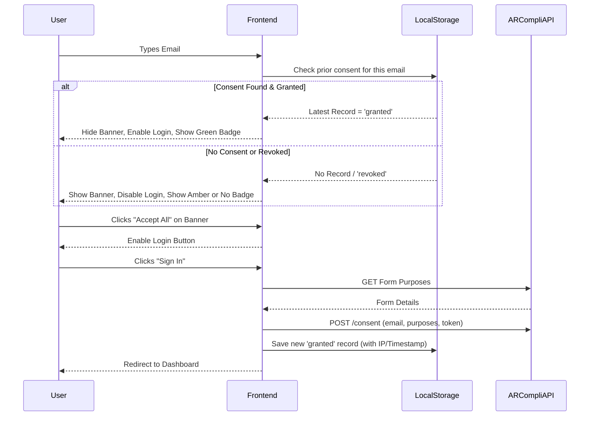

# Login & ARCompli Consent Flow Documentation

This document outlines the step-by-step flow of how user login interacts with the ARCompli consent system, including how consent is checked, stored locally, and posted to the ARCompli API.

## 1. Initial State & Page Load (`LoginPage.jsx`)
When a user navigates to the `/login` page:
- **Default States:**
  - `isConsentBannerOpen`: `true` (The consent banner at the bottom is visible by default).
  - `hasConsent`: `false` (The "Sign In" and "Demo Login" buttons are disabled).
  - `emailConsentStatus`: `null` (The UI badge under the email input is hidden).
- The page renders a 60/40 split layout with a hero section on the left and the login form on the right.

## 2. Dynamic Email Input Checking (Local "GET" Equivalent)
As the user types their email address into the input field, a debounced React `useEffect` hook runs (waits for 300ms of inactivity):
1. The app reads `arcompli_consent_records` from the browser's `localStorage`.
2. It filters records matching the typed email address.
3. If records exist, it sorts them by `timestamp` to find the most recent action (`'granted'` or `'revoked'`).
4. **Logic Branching:**
   - **If Status is `'granted'`**:
     - The consent banner slides down / hides (`isConsentBannerOpen = false`).
     - The login buttons become enabled (`hasConsent = true`).
     - A green check badge appears below the input saying *"Consent already granted for this email"*.
   - **If Status is `'revoked'` or No Record Exists**:
     - The consent banner slides up / shows (`isConsentBannerOpen = true`).
     - The login buttons remain disabled (`hasConsent = false`).
     - (If revoked, an amber warning badge appears below the input).

## 3. Granting Consent via the Banner
If the user clicks **"Accept All"** on the bottom consent banner:
1. `hasConsent` is set to `true` (Login buttons are enabled).
2. `isConsentBannerOpen` is set to `false` (Banner is hidden).
3. `localStorage.setItem('arcompli_consent_granted', 'true')` is executed as a global flag.
*(Note: At this stage, the actual API call is deferred until the user submits the login form).*

## 4. The Login Process (The "POST" Flow)
When the user clicks **"Sign In"** or **"Demo Login"**:

**Step A: API Request to ARCompli (`recordConsentAPI`)**
1. The app fetches the consent form details from ARCompli:
   `GET https://arcompli.com/api/v1/forms/cee13ce55f252b4cb6bbadf602ee0fc8`
2. It constructs a POST request to record the user's consent on the backend:
   `POST https://arcompli.com/api/v1/consent`
   - **Payload includes:** `form_token`, the user's `subject_email`, and an array of `purpose_id`s with `granted: true`.
   - **Auth:** Uses the Bearer token `arc_live_9fb5638ecf5008a0b2b9af199d985a9d`.

**Step B: Local Storage Record Creation (`storeLocalRecord`)**
1. The app fetches the user's external IP address using `https://api.ipify.org` (falls back to `localhost`).
2. A new consent record object is created:
   ```json
   {
     "id": "grant_1710500000_abcde",
     "email": "user@example.com",
     "action": "granted",
     "timestamp": "2026-03-16T10:00:00Z",
     "ip": "203.0.113.5",
     "userAgent": "Mozilla/5.0...",
     "source": "login" // or "demo"
   }
   ```
3. This record is appended to the `arcompli_consent_records` array in `localStorage`.
4. Finally, the user is authenticated via Context (`login(email)`) and redirected to `/dashboard`.

## 5. Consent History & Revocation (`ConsentHistoryPanel.jsx`)
Users can view and manage their consent by clicking the `⚙` (Gear) icon on the login page.
- **Viewing ("GET"):** The panel reads `arcompli_consent_records` from localStorage, groups them by email, and displays the history, timestamps, and IPs.
- **Revoking ("POST" Equivalent Local Override):** If the user clicks "Revoke" for an email:
  1. A new record is created with `"action": "revoked"`, the current IP, and timestamp.
  2. This record is appended to `arcompli_consent_records`, ensuring the latest chronological state for that email is now `revoked`.
  3. If this email was the globally active one, the global consent flag is cleared, ensuring the banner will appear again if that email is typed next time.

## Summary Diagram

